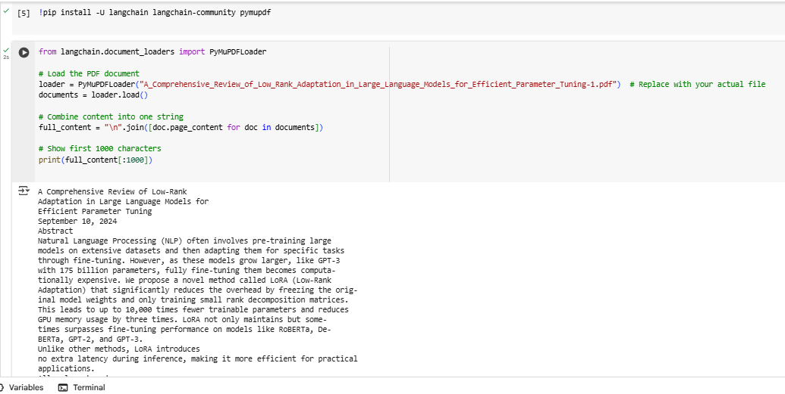
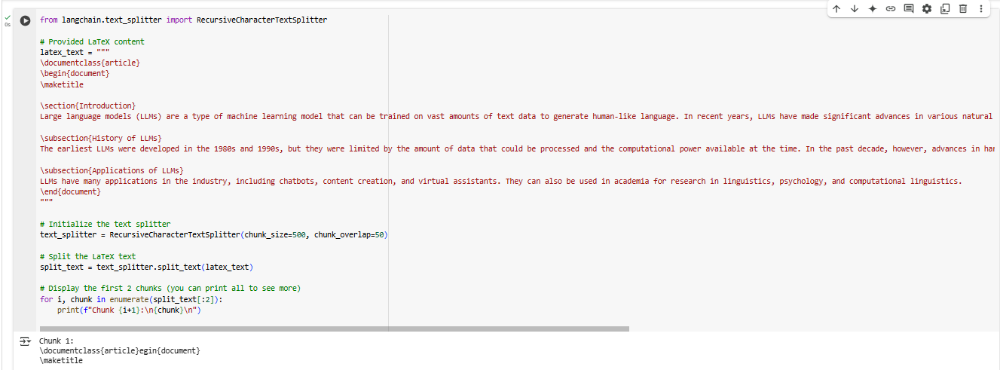
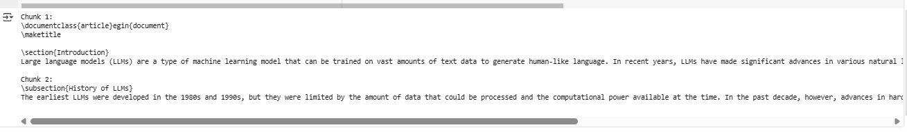
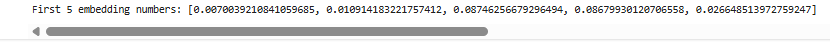
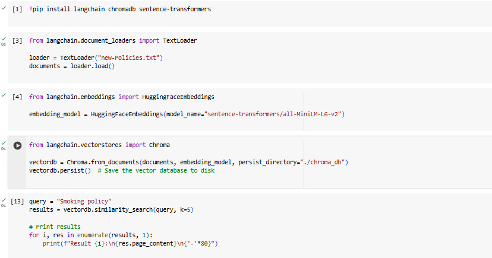
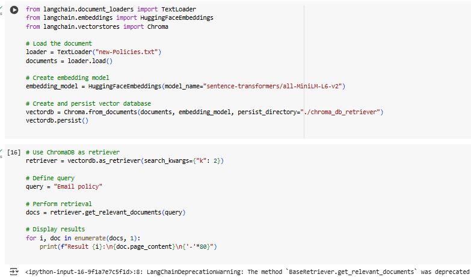
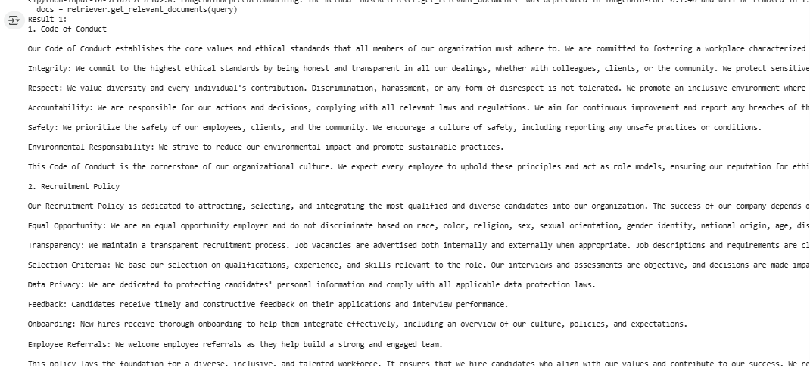
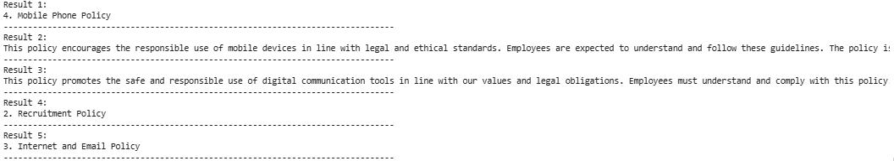

# ⛓ LangRAG — Document Intelligence

<div align="center">


**A production-ready RAG chatbot built with LangChain, ChromaDB, and free LLMs via OpenRouter.**  
Upload any PDF or TXT — ask questions grounded strictly in your document.

[🏅 IBM Certificate](https://www.coursera.org/account/accomplishments/verify/XJD5NZZIS29O) · [🌐 Portfolio](https://roman-ai.replit.app) · [💼 GitHub](https://github.com/romanahmad-dev)

</div>

---

## 🧠 What Is LangRAG?

**LangRAG** is a document-grounded Q&A system built on the **Retrieval-Augmented Generation (RAG)** architecture using the full LangChain ecosystem. Instead of relying on an LLM's internal memory (which can hallucinate), it:

1. **Loads** your PDF or TXT via LangChain document loaders
2. **Chunks** it using `RecursiveCharacterTextSplitter` with semantic overlap
3. **Embeds** each chunk locally using HuggingFace `all-MiniLM-L6-v2`
4. **Stores** embeddings in a persistent ChromaDB vector store
5. **Retrieves** top-K most relevant chunks for any query
6. **Answers** via Mistral 7B (free) on OpenRouter — grounded in your document

Zero hallucination. Every answer is traceable to your document.

---

## 🏗️ Architecture

```
┌─────────────────────────────────────────────────────────────┐
│                        INGESTION                            │
│                                                             │
│  PDF/TXT ──► PyMuPDFLoader/TextLoader ──► RecursiveTextSplitter │
│                                                    │         │
│                              HuggingFaceEmbeddings ◄─────── │
│                                          │                   │
│                                    ChromaDB (persist)        │
└─────────────────────────────────────────────────────────────┘
                              │
┌─────────────────────────────────────────────────────────────┐
│                         QUERYING                            │
│                                                             │
│  User Query ──► Embed Query ──► ChromaDB Similarity Search  │
│                                          │                   │
│                              Top-K Chunks (context)         │
│                                          │                   │
│                         LLM (Mistral 7B via OpenRouter)     │
│                                          │                   │
│                              Grounded Answer ──► User        │
└─────────────────────────────────────────────────────────────┘
```

---

## 📸 Pipeline Screenshots

| PDF Loader | Text Chunking |
|-----------|--------------|
|  |  |

| Chunk Output | Embeddings |
|-------------|-----------|
|  |  |

| ChromaDB Vector Store | Retriever Setup |
|----------------------|----------------|
|  |  |

| Retriever Output | Similarity Results |
|-----------------|-------------------|
|  |  |

---

## 🚀 Quick Start

### 1. Clone
```bash
git clone https://github.com/romanahmad-dev/botchain.git
cd botchain
```

### 2. Install
```bash
pip install -r requirements.txt
```

### 3. Configure API key (free)
```bash
cp .env.example .env
# Edit .env — add your free OpenRouter key from https://openrouter.ai
```

### 4. Run
```bash
python app.py
# Open http://localhost:7860
```

### 5. Use
- Paste your **OpenRouter API key** in the sidebar
- Upload a **PDF or TXT**, click **Ingest Document** — or click **Load Sample** to try immediately
- Ask questions in the chat box
- Expand **Retrieved Context** to see exactly what the LLM was given

---

## 📁 Project Structure

```
langrag/
├── app.py                    # Gradio UI — entry point
├── src/
│   ├── config.py             # All settings & env loader
│   ├── rag_pipeline.py       # Load → Chunk → Embed → Store → Retrieve
│   └── llm_client.py         # OpenRouter LLM integration
├── notebooks/
│   └── rag_app.ipynb         # Step-by-step RAG exploration notebook
├── Data/
│   ├── new-Policies.txt      # Sample: Company policy document
│   └── LoRA_Review_Paper.pdf # Sample: Academic PDF (LoRA paper)
├── Screenshots/              # Pipeline step screenshots
├── requirements.txt
├── .env.example
└── .gitignore
```

---

## 🔧 Tech Stack

| Component | Technology | Notes |
|-----------|-----------|-------|
| Document Loaders | `PyMuPDFLoader`, `TextLoader` | PDF + TXT support |
| Text Splitting | `RecursiveCharacterTextSplitter` | 500 chunk / 50 overlap |
| Embeddings | `HuggingFace all-MiniLM-L6-v2` | Free, runs locally |
| Vector Store | `ChromaDB` | Persistent on disk |
| LLM | Mistral 7B via OpenRouter | 100% free tier |
| UI | Gradio 4.x | Dark-themed chat interface |
| Config | `python-dotenv` | Secure env management |

---

## 🔑 Free API Setup

No credit card needed. OpenRouter offers permanently free models:

1. Sign up at [openrouter.ai](https://openrouter.ai)
2. Go to **Keys** → Create new key
3. Add to `.env`:
```
OPENROUTER_API_KEY=sk-or-xxxx
LLM_MODEL=mistralai/mistral-7b-instruct:free
```

**Other free models you can switch to:**
- `meta-llama/llama-3-8b-instruct:free`
- `google/gemma-7b-it:free`

---

## 🏅 Certification

Built as part of the **IBM Generative AI Applications with RAG and LangChain** course.

[](https://www.coursera.org/account/accomplishments/verify/XJD5NZZIS29O)

---

## 👨‍💻 Author

**Roman Ahmad** — AI Engineer

Specialises in LLM orchestration, RAG pipelines, and production AI systems.

[](https://roman-ai.replit.app)
[](https://github.com/romanahmad-dev)

---

## 📄 License

MIT — free to use, fork, and build on.
